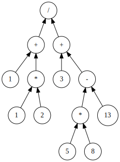

## Parser tutorial

Run example code

```bash
PYTHONPATH=. python bottom_up_parser.py "(1 + 1 * 2) / (3 + 5 * 8 - 13)" yes
```

Abstract Syntax Tree



MIPS code

```asm
mov $0 1
mul $0 2
mov $1 1
add $1 $0
mov $2 5
mul $2 8
mov $3 $2
sub $3 13
mov $4 3
add $4 $3
mov $5 $1
div $5 $4
ret $5
```
